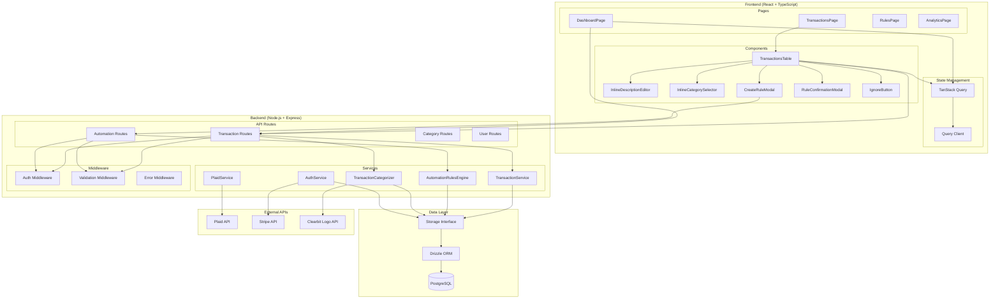
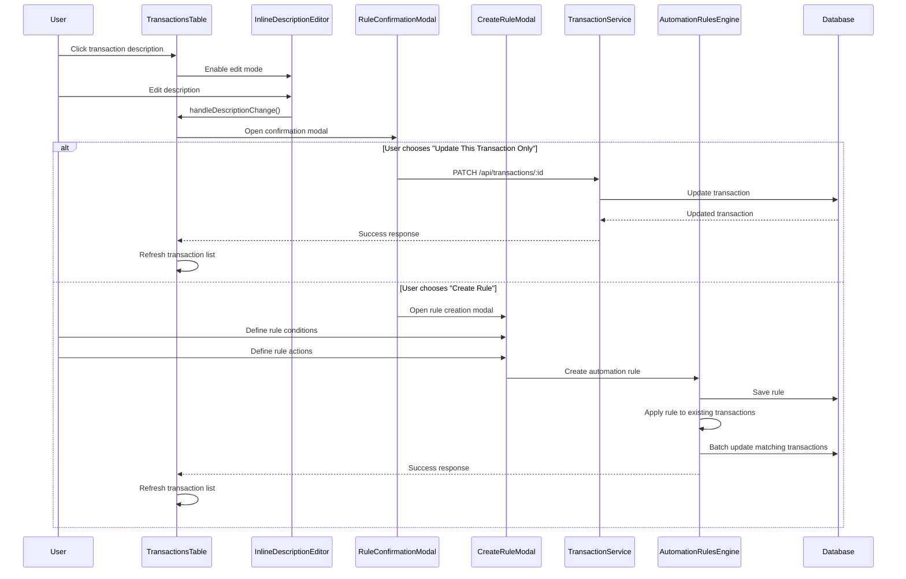
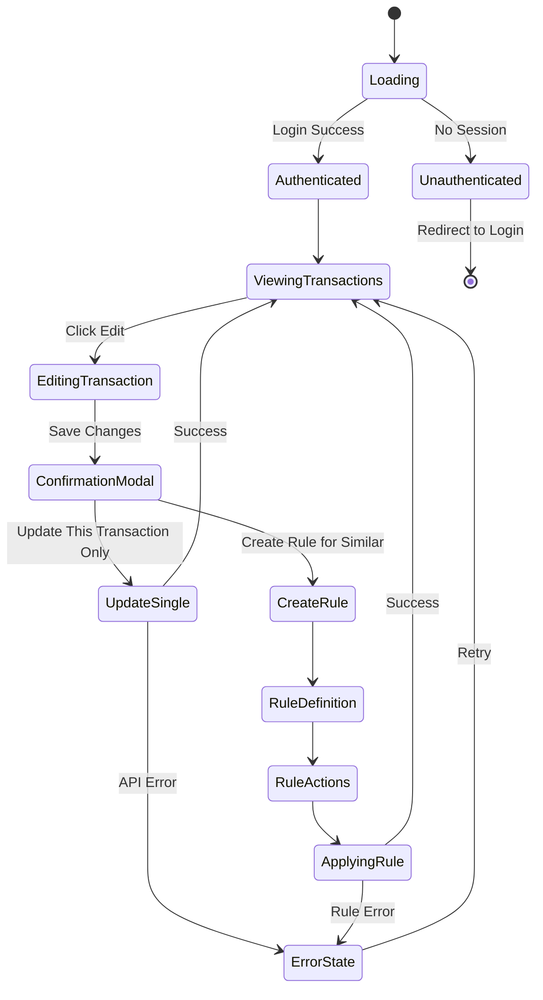
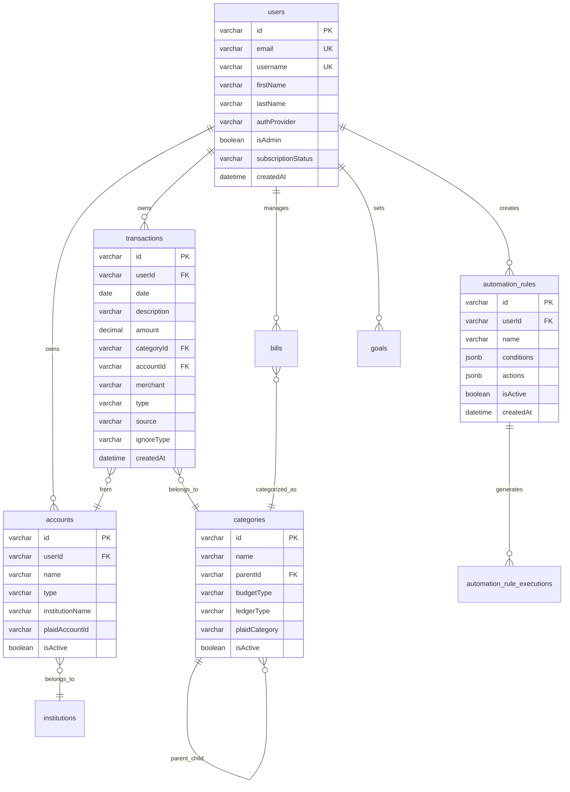
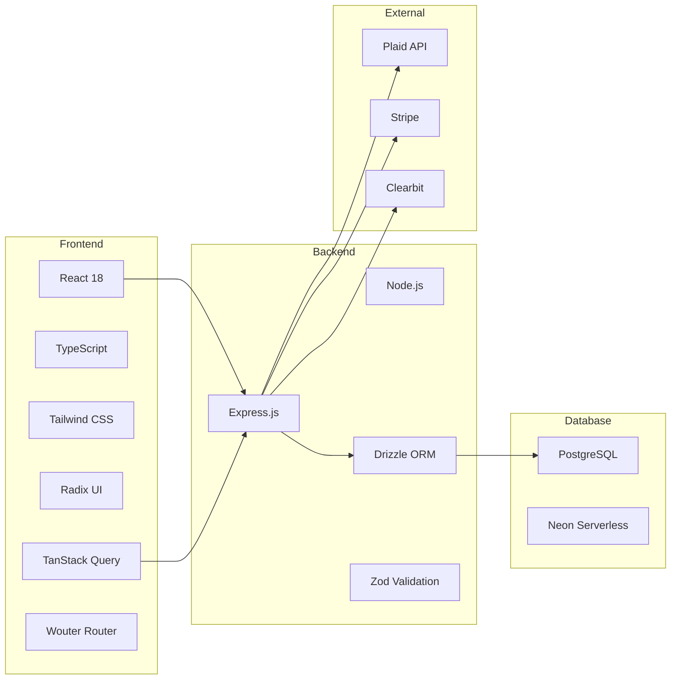

# BudgetHero - UML Architecture Documentation

## System Overview

BudgetHero is a gamified financial analytics platform that transforms financial management into an engaging experience through comprehensive transaction tracking, AI-powered insights, and automated rules engines.

## Class Diagram

```mermaid
classDiagram
    %% Core Domain Models
    class User {
        +string id
        +string email
        +string firstName
        +string lastName
        +string username
        +string profileImageUrl
        +string authProvider
        +boolean onboardingCompleted
        +boolean isAdmin
        +string subscriptionStatus
        +string subscriptionPlan
        +Date trialEndsAt
        +Date createdAt
        +Date updatedAt
    }

    class Transaction {
        +string id
        +Date date
        +string description
        +string rawAmount
        +string amount
        +string categoryId
        +string category
        +string type
        +string merchant
        +string accountId
        +string userId
        +string source
        +string ignoreType
        +Date createdAt
        +Date updatedAt
    }

    class Category {
        +string id
        +string name
        +string parentId
        +string budgetType
        +string ledgerType
        +string plaidCategory
        +boolean isActive
    }

    class Account {
        +string id
        +string name
        +string type
        +string institutionName
        +string plaidAccountId
        +string userId
        +boolean isActive
    }

    class AutomationRule {
        +string id
        +string name
        +string userId
        +object conditions
        +object actions
        +boolean isActive
        +Date createdAt
    }

    class Bill {
        +string id
        +string name
        +decimal amount
        +Date dueDate
        +string frequency
        +string categoryId
        +string userId
        +boolean isActive
    }

    %% Frontend Components
    class TransactionsTable {
        +Transaction[] transactions
        +handleDescriptionChange()
        +handleCategoryChange()
        +handleBulkDelete()
        +handleExport()
    }

    class InlineDescriptionEditor {
        +string currentDescription
        +boolean isEditing
        +handleSave()
        +handleCancel()
    }

    class InlineCategorySelector {
        +string currentCategory
        +Category[] categories
        +handleCategorySelect()
    }

    class CreateRuleModal {
        +Transaction transaction
        +object pendingChanges
        +handleRuleCreation()
        +previewMatchedTransactions()
    }

    class RuleConfirmationModal {
        +Transaction transaction
        +object pendingChanges
        +handleCreateRule()
        +handleUpdateOnly()
    }

    class Dashboard {
        +displayKPIs()
        +renderCharts()
        +showInsights()
    }

    %% Backend Services
    class TransactionService {
        +getTransactions()
        +updateTransaction()
        +deleteTransactions()
        +categorizeTransaction()
        +applyAutomationRules()
    }

    class AutomationRulesEngine {
        +applyRulesToTransactions()
        +evaluateConditions()
        +executeActions()
        +detectConflicts()
    }

    class TransactionCategorizer {
        +categorizeTransaction()
        +matchMerchant()
        +applyKeywordRules()
        +assignDefaultCategory()
    }

    class PlaidService {
        +syncTransactions()
        +refreshAccounts()
        +handleWebhooks()
    }

    class AuthService {
        +authenticateUser()
        +validateSession()
        +handleOAuth()
    }

    %% Data Layer
    class Storage {
        +getTransactions()
        +updateTransaction()
        +createAutomationRule()
        +getCategories()
        +getUserAccounts()
    }

    class DrizzleORM {
        +query()
        +insert()
        +update()
        +delete()
    }

    %% Relationships
    User ||--o{ Transaction : owns
    User ||--o{ Account : owns
    User ||--o{ AutomationRule : creates
    User ||--o{ Bill : manages
    
    Transaction }o--|| Category : belongs_to
    Transaction }o--|| Account : from
    
    TransactionsTable *-- InlineDescriptionEditor
    TransactionsTable *-- InlineCategorySelector
    TransactionsTable *-- CreateRuleModal
    TransactionsTable *-- RuleConfirmationModal
    
    TransactionService --> Storage
    AutomationRulesEngine --> Storage
    TransactionCategorizer --> Storage
    PlaidService --> Storage
    AuthService --> Storage
    
    Storage --> DrizzleORM
    DrizzleORM --> PostgreSQL[(PostgreSQL)]
    
    TransactionsTable --> TransactionService
    CreateRuleModal --> AutomationRulesEngine
    Dashboard --> TransactionService
```

## Component Architecture Diagram



## Sequence Diagram - Transaction Update Flow



## State Management Flow



## Database Schema Relationships



## Key Design Patterns

### 1. Repository Pattern
- **Storage Interface**: Abstracts data access logic
- **Drizzle ORM**: Provides type-safe database operations
- **Service Layer**: Business logic separated from data access

### 2. Command Pattern
- **Automation Rules Engine**: Encapsulates rule execution logic
- **Transaction Categorizer**: Handles classification algorithms
- **Mutation Handlers**: Manage state changes with rollback capability

### 3. Observer Pattern
- **React Query**: Reactive state management for server data
- **Real-time Updates**: Automatic UI refresh on data changes
- **Webhook Handlers**: Process external API notifications

### 4. Strategy Pattern
- **Authentication Providers**: Multiple OAuth implementations
- **Rule Conditions**: Pluggable rule evaluation strategies
- **Transaction Sources**: Different import/sync mechanisms

### 5. Factory Pattern
- **Component Factories**: Dynamic UI component generation
- **Rule Builders**: Programmatic rule creation
- **Query Builders**: Dynamic database query construction

## Technology Stack Integration



This UML documentation provides a comprehensive view of the BudgetHero application architecture, showing the relationships between components, data flow, and system interactions.