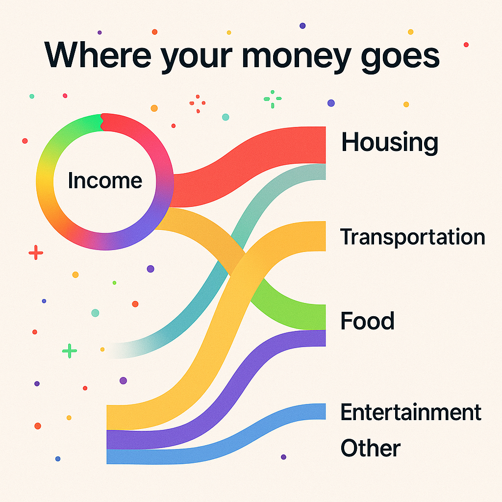

# BudgetHero — 5 Fast “Wow Factor” Features
Order: **fastest to ship → flashiest**. Each section includes **Why it wows**, **UX spec**, **Data/Backend**, **UI tasks**, and **Acceptance criteria**. Use this as your Replit `README.md`.

> Stack assumptions: React + shadcn/ui + Tailwind, Node/Express (or Flask) API, PostgreSQL + Drizzle/SQLAlchemy, Plaid import job, React Query for data fetching.

---

## 1) Spend Story (Weekly Highlight Reel) — *Low lift*
**Why it wows:** A human-friendly snapshot beats raw tables. Users instantly see what changed and what to do.

### UX spec
- Dashboard top **carousel** with 4–6 cards:
  - Biggest change (category or merchant, Δ% vs prior period)
  - New/unused subscription spotted
  - You saved $X (e.g., gas down vs last week)
  - Upcoming bill in ≤7 days
  - “Everything Else” burn rate (trend arrow)
- Each card has: emoji, title, one-line insight, **“See details”** → pre-filtered Transactions.

### Data/Backend
- Nightly job `spend_story_job(period=7|30)`:
  - Aggregates: `top_categories`, `top_merchants`, `delta_vs_prior_period`, `anomalies (z>2)`, `refunds`, `upcoming_recurring`.
- Table: `spend_story (id, user_id, period, created_at, cards jsonb)`.

**Pseudo-query (Postgres)**
```sql
-- Category deltas vs prior period
with cur as (
  select category, sum(amount) as cur_sum
  from transactions t
  where user_id=$1 and date >= now()-interval '7 days' and amount < 0
  group by 1
),
prev as (
  select category, sum(amount) as prev_sum
  from transactions t
  where user_id=$1 and date >= now()-interval '14 days' and date < now()-interval '7 days' and amount < 0
  group by 1
)
select c.category, c.cur_sum, p.prev_sum, (c.cur_sum - coalesce(p.prev_sum,0))/nullif(abs(p.prev_sum),0) as delta
from cur c left join prev p using (category)
order by delta desc nulls last limit 5;
```

### UI tasks
- `<SpendStoryCarousel cards={data.cards} />` with keyboard/drag.
- Tooltip “Why?” → show small breakdown query.

### Acceptance criteria
- Nightly job writes ≤6 cards.
- Clicking a card deep-links to filtered Transactions.
- Empty state shows friendly copy.

---

## 2) Inline Edit Everything + “Create a Rule?” — *Low–Medium*
**Why it wows:** Feels like a personal finance IDE; users teach the app as they fix things.

### UX spec
- Make **Category**, **Merchant name**, **Budgeted** inline-editable.
- After edit, toast: “Apply to similar?” → **Always / This time only / Undo**.
- `Esc` cancels; dashed underline on hover indicates editable.

### Data/Backend
- **Rules v1** table:
```sql
create table rules (
  id serial primary key,
  user_id uuid not null,
  match_merchant_regex text,
  match_memo_regex text,
  amount_min numeric,
  amount_max numeric,
  match_account text,
  set_category text,
  set_excluded boolean,
  set_merchant_name text,
  created_at timestamptz default now()
);
```
- Run rules server-side on import and on-demand “Re-run rules.”

### UI tasks
- Reusable `<InlineEditable value onSave onCancel />`.
- Command palette (`Ctrl/Cmd+K`): Re-categorize, Exclude, Split.
- Toast → “Create rule from this change.”

### Acceptance criteria
- Edit persists via API.
- Choosing **Always** creates a rule; re-import reclassifies matching items.
- Keyboard accessible (Tab, Enter, Esc).

---

## 3) Subscription Radar + Cancel Helpers — *Medium*
**Why it wows:** Finds recurring charges, price hikes, and gives a path to cancel/downgrade.

### UX spec
- **Subscriptions** tab with list and badges:
  - `$/mo`, cadence (monthly/annual), next charge date
  - **Price ↑ X%**, **Trial ends in N days**, **New** (2nd hit detected)
- Detail drawer: history graph, “Cancel/Downgrade options,” prefilled email/chat script.

### Detection logic
- A merchant is **recurring** if same merchant + similar amount occurs ≥2× in 90 days on a monthly or annual cadence.
- Flag **price hike** if amount increase ≥10% vs prior 2 charges.
- Store `provider_url`, `cancel_steps` in a small providers table.

**Schema**
```sql
create table subscriptions (
  id serial primary key,
  user_id uuid not null,
  merchant text not null,
  cadence text check (cadence in ('monthly','annual','other')),
  avg_amount numeric,
  last_amount numeric,
  last_seen date,
  next_estimated date,
  price_hike_percent numeric default 0,
  confidence numeric
);

create table subscription_providers (
  merchant text primary key,
  help_url text,
  cancel_steps text
);
```

### Acceptance criteria
- List shows detected items with cadence + next date.
- “View cancel options” opens steps + deep links.
- Price-hike badge appears when threshold met.

---

## 4) Cash‑flow Calendar + “Days Safe” Meter — *Medium*
**Why it wows:** Answers the #1 user anxiety: “Am I safe until payday?”

### UX spec
- Mini month grid; dots sized by **net daily flow** (inflows–outflows).
- Header: **Days Safe: N** (first day projected balance < 0).
- Click a day → shows expected items (rent, utilities, card mins).

### Projection model
- Inputs: balances, known recurring items, and **Everything Else** daily burn = 30‑day average of discretionary.
- Simulate daily for **next 60 days**; compute first negative.

**Pseudo-code**
```ts
let balance = sum(accounts.cash);
for (day of next60days) {
  balance += inflows(day) - outflows(day) - everythingElseDaily;
  if (balance < 0 && daysSafe === null) daysSafe = dayIndex;
}
```

### Acceptance criteria
- Days Safe updates when budgets or balances change.
- Hovering a date shows itemized forecast.
- Warn if <7 days safe; show targeted suggestions (pause/downgrade X).

---

## 5) “Where Your Money Goes” — Sankey Flow — *Medium→Higher (big wow)*
**Why it wows:** Visual storytelling: income streams → categories → merchants, with interactive drilldown.


### UX spec
- Sankey with **Income** on the left; **Categories/Subcategories/Merchants** to the right.
- Hover highlights flows + tooltip shows amount and % of income.
- Click a node/edge → filters Transactions.

### Data/Backend
- ETL job creates monthly **nodes** and **links**.
```sql
create table flow_nodes (id text primary key, label text, month date, user_id uuid);
create table flow_links (
  id serial primary key,
  month date, user_id uuid,
  source text, target text, value numeric
);
```
- Cap to top‑N merchants per category; bucket rest as **Everything Else**.

### Acceptance criteria
- Renders within 1s for typical data.
- Clicking narrows the Transactions table via query params.
- Mobile: vertical Sankey or fallback stacked bars.

---

## API Contracts (examples)
```ts
// GET /api/spend-story?period=7
type SpendStoryCard = { id: string; title: string; body: string; cta: { label: string; href: string } };
{ cards: SpendStoryCard[] }

// POST /api/rules
type CreateRule = { match: { merchantRegex?: string; memoRegex?: string; amountRange?: [number,number]; account?: string }, set: { category?: string; excluded?: boolean; merchantName?: string } }
{ id: string }

// GET /api/subscriptions
type SubscriptionItem = { merchant: string; cadence: 'monthly'|'annual'; nextDate: string; amount: number; priceHikePercent?: number; helpUrl?: string }

// GET /api/cashflow/forecast?days=60
type CashflowDay = { date: string; inflow: number; outflow: number; net: number; balance: number }
{ daysSafe: number; series: CashflowDay[] }

// GET /api/flows?month=2025-09
type Flow = { nodes: { id: string; label: string }[]; links: { source: string; target: string; value: number }[] }
```

---

## UI Components (shadcn/ui + Tailwind)
- `<SpendStoryCarousel />`
- `<InlineEditable />`, `<RuleToast />`
- `<SubscriptionsTable />`, `<SubscriptionDrawer />`
- `<CashflowCalendar />`, `<DaysSafeBadge />`
- `<SankeyChart />` (Recharts or @nivo/sankey)

---

## Rollout Plan
1. **Spend Story** (1–2 days): ETL aggregate + simple carousel.
2. **Inline Edit + Rules** (2–4 days): inline field, toast, rules table + apply.
3. **Subscription Radar** (3–5 days): cadence detection, list + drawer, provider steps.
4. **Cash‑flow Calendar** (3–5 days): forecast endpoint + month grid.
5. **Sankey Flow** (4–7 days): ETL + chart + transactions deep-link.

> Ship behind feature flags; enable per user. Track clicks on cards, rules created, cancels opened, days‑safe warnings.

---

## Analytics & Success Metrics
- Weekly active users viewing **Spend Story**.
- % edits that create **rules**; reduction in miscategorized rate.
- **Subscriptions**: detected → opened → cancelled/downgraded funnel.
- **Days Safe**: % users above 14 days after 30 days of use.
- **Sankey**: time-on-view, interactions, drill-throughs to Transactions.

---

## Testing Checklist
- [ ] a11y: keyboard focus rings, labels, roles, `aria-live` on toasts.
- [ ] Inline edits: Enter saves, Esc cancels, Undo works.
- [ ] Rules: re-import applies, “Re-run rules” endpoint idempotent.
- [ ] Subscriptions: price-hike detection correct on sample data.
- [ ] Forecast: balances never NaN; negative days flagged.
- [ ] Sankey: top‑N bucketing stable; mobile fallback renders.

---

## Copy Blocks (plug-and-play)
- Spend Story empty: “No highlights yet — connect another account or check again tomorrow.”
- Rule toast: “Apply this change to similar transactions?” **Always** / **Just this one** / **Undo**.
- Cancel helper CTA: “Open provider help center” / “Copy cancel email”.

---

## Env Flags (suggested)
```
FEATURE_SPEND_STORY=true
FEATURE_INLINE_RULES=true
FEATURE_SUBSCRIPTION_RADAR=false
FEATURE_CASHFLOW_CALENDAR=false
FEATURE_SANKEY_FLOW=false
```

---

### Notes
- Start with deterministic, explainable logic; add LLM summaries only for the **Spend Story** copy.
- Keep **Everything Else** as a first‑class concept across features.
- Celebrate wins: confetti when `Remaining >= 0` at month‑end; gentle nudge when not.
